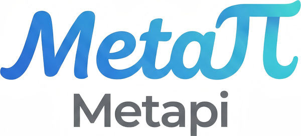
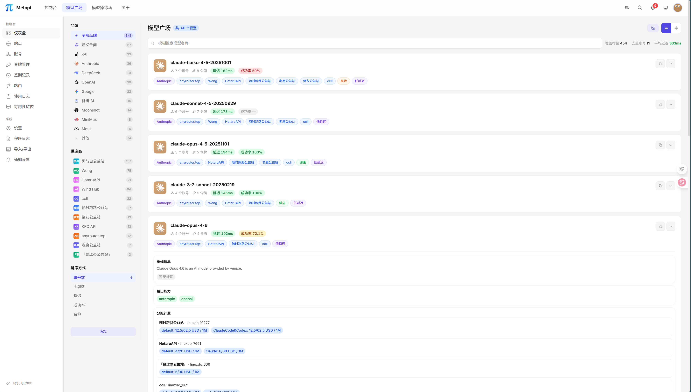
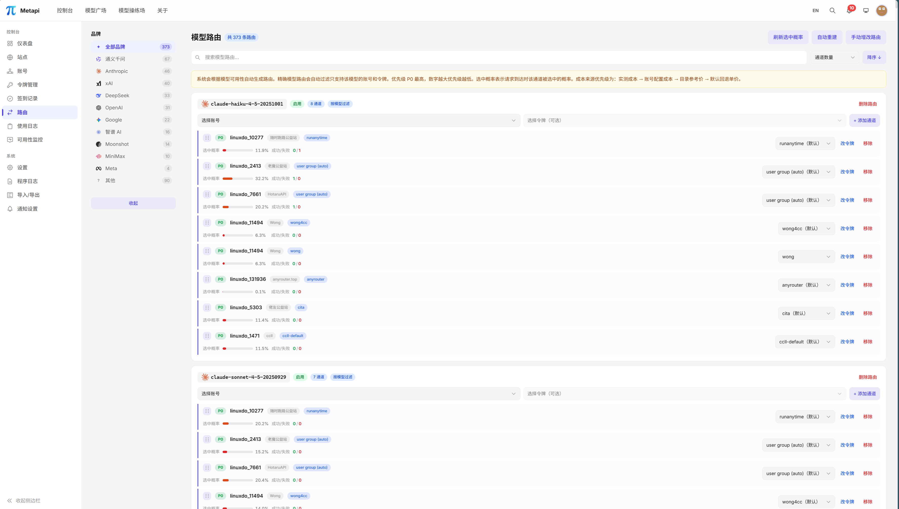

<div align="center">



**A relay for relays — aggregate scattered AI relay stations into one unified gateway**

<p>
Bring together all your New API / One API / OneHub / DoneHub / Veloera / AnyRouter / Sub2API sites
<br>
into <strong>one API Key, one endpoint</strong>, with automatic model discovery, smart routing, and cost optimization.
</p>

<p align="center">
  <a href="https://linux.do/t/topic/1671489" alt="LINUX DO">
    
  </a>
</p>

<p align="center">
<a href="https://github.com/cita-777/metapi/releases">
  
</a><!--
--><a href="https://github.com/cita-777/metapi/stargazers">
  
</a><!--
--><a href="https://deepwiki.com/cita-777/metapi">
  
</a><!--
--><a href="https://hub.docker.com/r/1467078763/metapi">
  
</a><!--
--><a href="https://hub.docker.com/r/1467078763/metapi">
  
</a><!--
--><a href="LICENSE">
  
</a><!--
--><!--
--><!--
--><a href="https://zeabur.com/templates/DOX5PR">
  
</a><!--
--><a href="https://render.com/deploy?repo=https://github.com/cita-777/metapi">
  
</a>
</p>

<p align="center">
  <a href="README.md">中文</a> |
  <a href="README_EN.md"><strong>English</strong></a>
</p>

<p align="center">
  <a href="https://metapi.cita777.me"><strong>Docs</strong></a> ·
  <a href="https://metapi.cita777.me/getting-started">Quick Start</a> ·
  <a href="https://metapi.cita777.me/deployment">Deployment</a> ·
  <a href="https://metapi.cita777.me/configuration">Configuration</a> ·
  <a href="https://metapi.cita777.me/client-integration">Client Integration</a> ·
  <a href="https://metapi.cita777.me/faq">FAQ</a> ·
  <a href="CONTRIBUTING.md">Contributing</a>
</p>

</div>

---

## 🌐 Live Demo

> Try Metapi without deploying — full-featured demo instance:

| | |
|---|---|
| 🔗 **Demo URL** | [metapi-t9od.onrender.com](https://metapi-t9od.onrender.com/) |
| 🔑 **Admin Token** | `123456` |

> **⚠️ Security Notice**: This is a public demo. **Do NOT enter any real API keys, credentials, or site information.** Data may be reset at any time.

> **ℹ️ Note**: Demo runs on Render free tier + OpenRouter free models (only `:free` suffixed models available). First visit may take 30-60s to wake up.

---

## About

The AI ecosystem is seeing a growing number of aggregation relay stations based on New API / One API and similar projects. Managing balances, model lists, and API keys across multiple sites is scattered and time-consuming.

**Metapi** acts as the **Meta-Aggregation Layer** on top of these relay stations, unifying multiple sites into **one endpoint (with configurable per-project downstream API Keys)** — all downstream tools (Cursor, Claude Code, Codex, Open WebUI, etc.) can seamlessly access all models. Currently supported upstream platforms:

- [New API](https://github.com/QuantumNous/new-api)
- [One API](https://github.com/songquanpeng/one-api)
- [OneHub](https://github.com/MartialBE/one-hub)
- [DoneHub](https://github.com/deanxv/done-hub)
- [Veloera](https://github.com/Veloera/Veloera)
- [AnyRouter](https://anyrouter.top) — Universal routing platform
- [Sub2API](https://github.com/Wei-Shaw/sub2api) — Subscription-based relay

| Pain Point | How Metapi Solves It |
| --- | --- |
| One key per site, tedious client config | **Unified proxy endpoint + optional per-project downstream keys** — all site models auto-aggregated under `/v1/*` |
| No idea which site offers the cheapest model | **Smart routing** auto-selects the optimal channel by cost, balance, and usage |
| Site goes down, manual switching is a hassle | **Auto-failover** — failed channels cool down and traffic shifts automatically |
| Balances scattered everywhere | **Centralized dashboard** — at-a-glance overview with low-balance alerts |
| Daily check-ins across sites | **Auto check-in** — scheduled execution with reward tracking |
| Don't know which site has which models | **Auto model discovery** — new upstream models appear with zero config |

---

## Screenshots

<table>
  <tr>
    <td align="center">
      
      <div><b>Dashboard</b> — Balance distribution, spending trends, system overview</div>
    </td>
    <td align="center">
      
      <div><b>Model Marketplace</b> — Cross-site model coverage, pricing comparison, measured metrics</div>
    </td>
  </tr>
  <tr>
    <td align="center">
      
      <div><b>Smart Routing</b> — Multi-channel probability distribution, cost-priority routing</div>
    </td>
    <td align="center">
      
      <div><b>Account Management</b> — Multi-site multi-account, health state tracking</div>
    </td>
  </tr>
  <tr>
    <td align="center">
      
      <div><b>Site Management</b> — Upstream site configuration and status overview</div>
    </td>
    <td align="center">
      
      <div><b>Token Management</b> — API Token lifecycle management</div>
    </td>
  </tr>
  <tr>
    <td align="center">
      
      <div><b>Model Playground</b> — Interactive online model testing</div>
    </td>
    <td align="center">
      
      <div><b>Check-in Log</b> — Auto check-in status and reward tracking</div>
    </td>
  </tr>
  <tr>
    <td align="center">
      
      <div><b>Usage Logs</b> — Proxy request logs and cost breakdown</div>
    </td>
    <td align="center">
      
      <div><b>Availability Monitor</b> — Channel health real-time monitoring</div>
    </td>
  </tr>
  <tr>
    <td align="center">
      
      <div><b>System Settings</b> — Global parameters and security configuration</div>
    </td>
    <td align="center">
      
      <div><b>Notification Settings</b> — Multi-channel alert and push configuration</div>
    </td>
  </tr>
</table>

---

## Architecture Overview

**Downstream Clients** (Cursor · Claude Code · Codex · Open WebUI · Cherry Studio, etc.)
&emsp;↓ &ensp;`Authorization: Bearer <PROXY_TOKEN>`
**Metapi Gateway**
&emsp;• Unified `/v1` proxy for core OpenAI / Claude-compatible endpoints (Responses, Chat Completions, Messages, Completions, Embeddings, Images, Models)
&emsp;• Smart Routing Engine — weighted selection by cost, balance, and availability; auto-cooldown & retry on failure
&emsp;• Model Discovery — auto-aggregates all upstream models with zero config
&emsp;• Format Conversion — transparent bidirectional OpenAI ⇄ Claude conversion
&emsp;• Auto Check-in · Balance Management · Alerts & Notifications · Data Dashboard
&emsp;↓
**Upstream Platforms** (New API · One API · OneHub · DoneHub · Veloera · AnyRouter · Sub2API …)

---

## Features

### Unified Proxy Gateway

- Compatible with **OpenAI** and **Claude** downstream formats, works with all mainstream clients
- Supports Responses / Chat Completions / Messages / Completions (Legacy) / Embeddings / Images / Models, plus standard `/v1/files`
- Full SSE streaming support with automatic format conversion (OpenAI <-> Claude)

### Smart Routing Engine

- Auto-discovers all available models from upstream sites — **zero-config** route table generation
- Four-tier cost signal: **measured cost -> account-configured cost -> catalog reference price -> default fallback**
- Multi-channel probabilistic distribution weighted by cost (40%), balance (30%), and usage (30%)
- Failed channels auto-cool down (default 10-minute cooldown)
- Auto-retry on failure with automatic channel switching
- Routing decisions are visually explainable — every choice is transparent and auditable

<div align="center">
  
  <p><sub>Smart Routing UI — supports exact match, wildcards, probability distribution, and more routing strategies</sub></p>
</div>

### Multi-Platform Aggregation

| Platform | Adapter | Description |
| --- | --- | --- |
| **New API** | `new-api` | Next-gen LLM gateway |
| **One API** | `one-api` | Classic OpenAI API aggregation |
| **OneHub** | `onehub` | Enhanced One API fork |
| **DoneHub** | `done-hub` | Enhanced OneHub fork |
| **Veloera** | `veloera` | API gateway platform |
| **AnyRouter** | `anyrouter` | Universal routing platform |
| **Sub2API** | `sub2api` | Subscription-based relay |

Adapters cover shared capabilities such as model discovery, balance access, token management, and proxy integration; login, check-in, and user-info flows vary by platform.

### Account & Token Management

- **Multi-site, multi-account**: Each site supports multiple accounts, each account can hold multiple API tokens
- **Health tracking**: `healthy` / `unhealthy` / `degraded` / `disabled` four-state machine
- **Encrypted credential storage**: All sensitive credentials are encrypted in the local database
- **Auto-renewal**: Tokens are automatically re-authenticated when expired
- **Cascading control**: Disabling a site automatically disables all associated accounts

### Model Marketplace

- Cross-site model coverage overview: which models are available, how many accounts cover them, pricing comparison
- Latency, success rate, and other measured metrics
- Upstream model catalog caching with brand classification (OpenAI, Anthropic, Google, DeepSeek, etc.)
- Interactive model tester for online verification

<div align="center">
  
  <p><sub>Model Marketplace — browse all available models' coverage, pricing, and performance metrics in one place</sub></p>
</div>

### Auto Check-in

- Cron-scheduled automatic check-in (default: daily at 08:00)
- Smart reward parsing with failure notifications
- Per-account execution with enable/disable control
- Full check-in logging with history queries
- Concurrency locking to prevent duplicate check-ins

### Balance Management

- Scheduled balance refresh (default: every hour), batch updates for all active accounts
- Income tracking: daily/cumulative income with spending trend analysis
- Balance fallback estimation: infer balance changes from proxy logs when API is unavailable
- Auto re-login on credential expiry

### Alerts & Notifications

Five notification channels supported:

| Channel | Description |
| --- | --- |
| **Webhook** | Custom HTTP push |
| **Bark** | iOS push notifications |
| **ServerChan** | WeChat notifications |
| **Telegram Bot** | Telegram message notifications |
| **SMTP Email** | Standard email notifications |

Alert scenarios: low balance warning, site/account anomalies, check-in failures, proxy request failures, token expiry reminders, daily summary reports. Alert cooldown mechanism (default: 300 seconds) prevents duplicate notifications.

### Data Dashboard

- Site balance pie chart, daily spending trend graphs
- Global search (sites, accounts, models)
- System event logs, proxy request logs (model, status, latency, token usage, cost estimation)

<div align="center">
  
  <p><sub>Data Dashboard — balance distribution, spending trends, system health at a glance</sub></p>
</div>

### Model Playground

- Interactive chat testing to instantly verify model availability and response quality
- Select any routed model to compare outputs across different channels
- Streaming / non-streaming dual mode testing

<div align="center">
  
  <p><sub>Model Playground — interactive online testing, verify model availability and response quality</sub></p>
</div>

### Lightweight Deployment

- **Single Docker container** with a default local data directory, plus optional external MySQL / PostgreSQL runtime DB
- Docker images support `amd64`, `arm64`, and `armv7l` (`linux/arm/v7`) server deployments
- Full data import/export for worry-free migration

---

## Quick Start

### Docker Compose (Recommended)

```bash
mkdir metapi && cd metapi

cat > docker-compose.yml << 'EOF'
services:
  metapi:
    image: 1467078763/metapi:latest
    ports:
      - "4000:4000"
    volumes:
      - ./data:/app/data
    environment:
      AUTH_TOKEN: ${AUTH_TOKEN:?AUTH_TOKEN is required}
      PROXY_TOKEN: ${PROXY_TOKEN:?PROXY_TOKEN is required}
      CHECKIN_CRON: "0 8 * * *"
      BALANCE_REFRESH_CRON: "0 * * * *"
      PORT: ${PORT:-4000}
      DATA_DIR: /app/data
      TZ: ${TZ:-Asia/Shanghai}
    restart: unless-stopped
EOF

# Set tokens and start
# AUTH_TOKEN = Admin panel login token (enter this value when logging in)
export AUTH_TOKEN=your-admin-token
# PROXY_TOKEN = Token for downstream clients to call /v1/*
export PROXY_TOKEN=your-proxy-sk-token
docker compose up -d
```

<details>
<summary><strong>One-line Docker command</strong></summary>

```bash
docker run -d --name metapi \
  -p 4000:4000 \
  -e AUTH_TOKEN=your-admin-token \
  -e PROXY_TOKEN=your-proxy-sk-token \
  -e TZ=Asia/Shanghai \
  -v ./data:/app/data \
  --restart unless-stopped \
  1467078763/metapi:latest
```

</details>

After starting, visit `http://localhost:4000` and log in with your `AUTH_TOKEN`!

> [!NOTE]
> Docker images support `amd64`, `arm64`, and `armv7l` (`linux/arm/v7`) server deployments.
> Current `armv7l` support is limited to server / Docker usage and does not include Electron desktop packaging support.

<!-- markdownlint-disable-next-line MD028 -->
> [!IMPORTANT]
> Make sure to change `AUTH_TOKEN` and `PROXY_TOKEN` — do not use default values. Data is stored in the `./data` directory and persists across upgrades.

> [!TIP]
> The initial admin token is the `AUTH_TOKEN` configured at startup.
> If running outside Compose without explicitly setting `AUTH_TOKEN`, the default is `change-me-admin-token` (for local debugging only).
> The desktop installer falls into this category on first launch too: if you do not inject `AUTH_TOKEN`, the default admin token is also `change-me-admin-token`.
> If you change the admin token in the Settings panel, use the new token for subsequent logins.

For Docker Compose, desktop installers, reverse proxy, upgrades, and database options, see [Deployment Guide](docs/deployment.md).

---

## Documentation

> Docs site (VitePress) local preview:
>
> ```bash
> npm run docs:dev
> ```
>
> Docs site build:
>
> ```bash
> npm run docs:build
> ```
>
> GitHub Actions auto publish: each push to `main` runs `.github/workflows/docs-pages.yml` and deploys to GitHub Pages.
> First-time setup in repository settings:
> `Settings -> Pages -> Build and deployment -> Source: GitHub Actions`

| Category | Link | Description |
| --- | --- | --- |
| Docs Home | [docs/index.md](docs/index.md) | Publishable docs portal with nav/sidebar/search |
| Docs Maintenance | [docs/README.md](docs/README.md) | Maintenance and contributor-oriented docs entry |
| Quick Start | [docs/getting-started.md](docs/getting-started.md) | Get running in 10 minutes |
| Deployment | [docs/deployment.md](docs/deployment.md) | Docker Compose, reverse proxy, upgrades |
| Configuration | [docs/configuration.md](docs/configuration.md) | All environment variables and routing params |
| Client Integration | [docs/client-integration.md](docs/client-integration.md) | Open WebUI / Cherry Studio / Cursor, etc. |
| Operations | [docs/operations.md](docs/operations.md) | Backup, logging, health checks |
| FAQ | [docs/faq.md](docs/faq.md) | Common errors and fixes |
| FAQ/Tutorial Contribution | [docs/community/faq-tutorial-guidelines.md](docs/community/faq-tutorial-guidelines.md) | Templates and workflow for community knowledge |

---

## Environment Variables

### Basic Configuration

| Variable | Description | Default |
| --- | --- | --- |
| `AUTH_TOKEN` | Admin panel login token (**must change**) | `change-me-admin-token` |
| `PROXY_TOKEN` | Proxy API Bearer Token (**must change**) | `change-me-proxy-sk-token` |
| `PORT` | Service listening port | `4000` |
| `DATA_DIR` | Data directory for local runtime data | `./data` |
| `TZ` | Timezone | `Asia/Shanghai` |
| `ACCOUNT_CREDENTIAL_SECRET` | Account credential encryption key | Defaults to `AUTH_TOKEN` |

### Scheduled Tasks

| Variable | Description | Default |
| --- | --- | --- |
| `CHECKIN_CRON` | Auto check-in cron expression | `0 8 * * *` |
| `BALANCE_REFRESH_CRON` | Balance refresh cron expression | `0 * * * *` |

<details>
<summary><strong>Smart Routing, Notification & Security Configuration</strong></summary>

See [docs/configuration.md](docs/configuration.md) for full details on smart routing parameters, notification channels (Webhook / Bark / ServerChan / Telegram / SMTP), and security settings (IP allowlist).

</details>

Full configuration reference: [docs/configuration.md](docs/configuration.md)

---

## Proxy API Endpoints

Metapi exposes standard OpenAI / Claude compatible endpoints:

| Endpoint | Method | Description |
| --- | --- | --- |
| `/v1/responses` | POST | OpenAI Responses |
| `/v1/chat/completions` | POST | OpenAI Chat Completions |
| `/v1/messages` | POST | Claude Messages |
| `/v1/completions` | POST | OpenAI Completions (Legacy) |
| `/v1/embeddings` | POST | Embeddings |
| `/v1/images/generations` | POST | Image Generation |
| `/v1/files` | POST / GET | OpenAI Files upload and list |
| `/v1/files/:fileId` | GET / DELETE | OpenAI Files retrieve metadata and delete |
| `/v1/files/:fileId/content` | GET | OpenAI Files raw content |
| `/v1/models` | GET | List all available models |

Include `Authorization: Bearer <PROXY_TOKEN>` in request headers.

The global `PROXY_TOKEN` works by default.
From `System Settings -> Downstream API Key Strategy` you can create multiple project-level downstream keys with individual configuration:

- Expiration time (expiresAt)
- Cost and request limits (MaxCost / MaxRequests)
- Model allowlist (SupportedModels, supports exact/glob/re:regex)
- Route allowlist (AllowedRouteIds)
- Site weight multipliers (SiteWeightMultipliers, control per-project upstream preference ratios)

---

## Client Integration

Compatible with all OpenAI API-compatible clients:

| Setting | Value |
| --- | --- |
| **Base URL** | `https://your-domain.com` (clients usually append `/v1` automatically) |
| **API Key** | Your configured `PROXY_TOKEN` |
| **Model List** | Auto-fetched from `GET /v1/models` |

Standard OpenAI `/v1/files` workflows are also supported for clients that use the official file API.

For detailed per-client setup, examples, and troubleshooting, see [docs/client-integration.md](docs/client-integration.md).

---

## Tech Stack

| Layer | Technology |
| --- | --- |
| **Backend** | [Fastify](https://fastify.dev) — High-performance Node.js framework |
| **Frontend** | [React 18](https://react.dev) + [Vite](https://vitejs.dev) |
| **Language** | [TypeScript](https://www.typescriptlang.org) — End-to-end type safety |
| **Styling** | [Tailwind CSS v4](https://tailwindcss.com) — Utility-first CSS framework |
| **Database** | SQLite / MySQL / PostgreSQL + [Drizzle ORM](https://orm.drizzle.team) |
| **Charts** | [VChart](https://visactor.io/vchart) (@visactor/react-vchart) |
| **Scheduling** | [node-cron](https://github.com/node-cron/node-cron) |
| **Containerization** | Docker (Debian slim) + Docker Compose |
| **Testing** | [Vitest](https://vitest.dev) |

---

## Local Development

```bash
# Install dependencies
npm install

# Run database migrations
npm run db:migrate

# Start dev environment (frontend + backend hot reload)
npm run dev
```

```bash
npm run build          # Build frontend + backend
npm run build:web      # Build frontend only (Vite)
npm run build:server   # Build backend only (TypeScript)
npm run dist:desktop:mac:intel # Build mac Intel (x64) desktop installer
npm test               # Run all tests
npm run test:watch     # Watch mode
npm run db:generate    # Generate Drizzle migration files
```

---

## Related Projects

### Compatible Upstream Platforms

| Project | Description |
| --- | --- |
| [New API](https://github.com/QuantumNous/new-api) | Next-gen LLM gateway, one of Metapi's primary upstreams |
| [One API](https://github.com/songquanpeng/one-api) | Classic OpenAI API aggregation |
| [OneHub](https://github.com/MartialBE/one-hub) | Enhanced One API fork |
| [DoneHub](https://github.com/deanxv/done-hub) | Enhanced OneHub fork |
| [Veloera](https://github.com/Veloera/Veloera) | API gateway platform |

### Referenced & Used Projects

| Project | Description |
| --- | --- |
| [All API Hub](https://github.com/qixing-jk/all-api-hub) | Browser extension — all-in-one relay account manager, Metapi's original inspiration |
| [LLM Metadata](https://github.com/nicepkg/llm-metadata) | LLM model metadata library, used for model description reference |
| [New API](https://github.com/QuantumNous/new-api) | Platform adapter reference implementation |

---

## Data & Privacy

Metapi is fully self-hosted. All data (accounts, tokens, routes, logs) stays in your own deployment environment. No data is sent to any third party. Proxy requests are transmitted directly between your server and upstream sites only.

---

## Contributing

All forms of contribution are welcome!

- Report bugs — [Submit an Issue](https://github.com/cita-777/metapi/issues)
- Feature suggestions — [Start a Discussion](https://github.com/cita-777/metapi/issues)
- Code contributions — [Submit a Pull Request](https://github.com/cita-777/metapi/pulls)
- Contributing guide — [CONTRIBUTING.md](CONTRIBUTING.md)
- Code of conduct — [CODE_OF_CONDUCT.md](CODE_OF_CONDUCT.md)

---

## Security

If you discover a security issue, please refer to [SECURITY.md](SECURITY.md) and report it privately.

---

## License

[MIT](LICENSE)

---

## Thanks

Thanks to everyone who has contributed code, bug reports, ideas, and real-world feedback to Metapi. A lot of the product polish in this project came directly from community usage and iteration.

Special thanks to all contributors:

<!-- metapi-contributors:start -->
<p align="left">
  <a href="https://github.com/cita-777"></a> <a href="https://github.com/Hureru"></a> <a href="https://github.com/bnvnvnv"></a> <a href="https://github.com/ksmaze"></a> <a href="https://github.com/DeliciousBuding"></a> <a href="https://github.com/Shinku-Chen"></a> <a href="https://github.com/weijiafu14"></a> <a href="https://github.com/ShicYang"></a> <a href="https://github.com/Babylonehy"></a> <a href="https://github.com/zmoon460"></a>
  <a href="https://github.com/Brucents"></a> <a href="https://github.com/ImgBotApp"></a> <a href="https://github.com/Zhou-Ruichen"></a> <a href="https://github.com/nodca"></a> <a href="https://github.com/puyujian"></a> <a href="https://github.com/rcocco"></a> <a href="https://github.com/xuyufengfei"></a>
</p>
<!-- metapi-contributors:end -->

---

## Star History

[](https://www.star-history.com/#cita-777/metapi&type=date&legend=top-left)

---

<div align="center">

**If Metapi helps you, a Star is the best support!**

<sub>Built with love by the AI community</sub>

</div>
